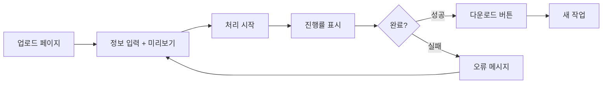

# PDF 보안 처리 시스템 — 웹 전환 기획서

> **문서 목적**: 데스크톱(tkinter) 앱을 웹 서비스로 전환하기 위한 공동 기획 문서  
> **작성일**: 2026-06-22  
> **상태**: Phase 2 완료 — Phase 3(배포) 진행 대기

---

## 확정 사항 요약 (2026-06-22)

| 항목 | 결정 |
|------|------|
| 전환 이유 | Gatekeeper 제거, 브라우저 접근, URL 공유, **이력·DB 기반 마련** |
| 아키텍처 | **모놀리식 웹앱** (FastAPI + 서버 렌더링) |
| 배포 | **Railway** (PaaS, 월 ~$5) |
| 인증·DB | **Supabase** (Auth + 2차 Postgres 이력) |
| 임시 PDF 저장 | **컨테이너 로컬 `/tmp`** (MVP, 별도 설정 불필요) |
| 데스크톱 앱 | **웹만** |
| 워터마크 시작 페이지 | **MVP 설정 UI** (기본 5페이지) |
| 폰트 | **나눔고딕 번들** |
| 파일 보관 | 완료 후 **1시간** 삭제 |
| 접근 권한 | **팀 소수**, Supabase Auth |

---

## 0. 문서 사용 방법

- `[ ]` / `[x]`: 결정·완료 체크
- `<!-- TODO: -->`: 아직 정하지 않은 항목
- **굵은 질문**: 의사결정이 필요한 지점 — 의견을 적어 주세요
- 섹션 번호는 유지하고, 내용만 자유롭게 수정합니다

---

## 1. 전환 배경 및 목표

### 1.1 현재 상태 요약

| 항목 | 내용 |
|------|------|
| 형태 | Python 단일 파일(`pdf_secure.py`) + tkinter GUI |
| 배포 | PyInstaller macOS 실행 파일, GitHub Actions 빌드 |
| 핵심 기능 | 워터마크 삽입, 메타데이터, PDF 비밀번호 설정 |
| 사용량(추정) | 주간 10건 미만, PDF 평균 200페이지 |
| 사용자 | 운영자 1명(본인) — 구매자별 PDF 1건씩 처리 |

### 1.2 웹 전환을 검토하는 이유

아래 중 해당하는 항목에 체크해 주세요.

- [x] macOS 전용 실행 파일 설치·Gatekeeper 이슈 제거
- [x] PC 없이 브라우저만으로 처리
- [x] 팀원/외주에게 URL만 공유해 사용
- [x] 처리 이력·구매자 DB 연동 기반 마련
- [ ] 기타: _______________________

### 1.3 전환 목표 (초안)

**1차 목표 (MVP)**  
현재 GUI와 동일한 작업을 브라우저에서 수행한다.

1. 원본 PDF 업로드
2. 구매자 이름·연락처·PDF 비밀번호 입력
3. 워터마크 문구 미리보기
4. **워터마크 시작 페이지 설정** (기본값: 5페이지)
5. 처리 진행률 표시
6. 완성 PDF 다운로드 (`{원본파일명}_{구매자명}.pdf`)
7. **팀 계정 로그인** (소수 운영자)

**비목표 (1차에서 제외)**  
- 배치 처리(CSV 일괄)
- 워터마크 위치·색상·투명도 커스터마이징
- 구매자 포털(구매자가 직접 다운로드)
- 결제·주문 시스템 연동
- 처리 이력 DB **전체 UI** (MVP 이후 2차 — 기반만 마련)

---

## 2. 현재 기능 → 웹 기능 매핑

### 2.1 기능 대응표

| # | 현재(데스크톱) | 웹(MVP) | 비고 |
|---|----------------|---------|------|
| F1 | 파일 선택 다이얼로그 | 파일 업로드 (`<input type="file">` 또는 드래그앤드롭) | PDF만 허용 |
| F2 | 이름·연락처·비밀번호 입력 | 동일 폼 | 유효성 검증 동일 |
| F3 | 워터마크 미리보기 | 클라이언트 실시간 미리보기 | 서버 불필요 |
| F4 | 진행률·상태 메시지 | 폴링 또는 WebSocket/SSE | 장시간 작업 대응 |
| F5 | 로컬 디스크에 저장 | 브라우저 다운로드 | |
| F6 | 스레드 비동기 처리 | 백그라운드 작업 큐 | API 타임아웃 회피 |
| F7 | OS별 한글 폰트 자동 탐색 | **서버에 폰트 번들** | 웹의 핵심 변경점 |
| F8 | 5페이지부터 워터마크 | **시작 페이지 설정 UI** (기본 5) | `add_watermark()`에 `start_page` 파라미터 추가 |
| F9 | 메타데이터·암호화 | 동일 로직 유지 | pypdf 동일 |

### 2.2 워터마크·보안 규칙 (현행 유지)

문서만으로 재구현 가능하도록 현행 스펙을 고정합니다.

```
워터마크 문구: "이 책은 {이름} ({연락처}) 님이 구매하신 전자책입니다."
적용 페이지: 설정값부터 (기본 5번째 페이지, 인덱스 4+)
위치: A4 기준 왼쪽 하단 (x=30, y=30+font_size*1.5)
폰트 크기: 10pt
색상: RGB(0.5, 0.5, 0.5), 투명도 60%
암호화: user/owner 동일 비밀번호, 128bit
출력 파일명: {원본파일명}_{구매자명}.pdf
메타데이터:
  /Author: 올라
  /Subject: 구매자 정보: {이름} ({연락처})
  /Creator: 올라의 꿀수면 프로젝트
```

> **결정**: MVP에 **설정 UI 추가** (기본값 5페이지 유지)

---

## 3. 아키텍처 후보

### 3.1 공통 제약

| 제약 | 영향 |
|------|------|
| PDF 평균 10~50MB (200페이지) | API Gateway 6MB 제한 → **직접 업로드 불가**, 스토리지 경유 필요 |
| 처리 시간 수 초~1분 | HTTP 동기 응답 부적합 → **비동기 작업** 필수 |
| 한글 폰트 | 서버에 TTF 번들 (`assets/fonts/`) |
| 주간 ~10건 | 과도한 인프라 불필요, **단순·저비용** 우선 |

### 3.2 후보 A: 모놀리식 웹앱 (권장 — MVP)

```
[브라우저] ──HTTPS──▶ [FastAPI/Flask]
                           │
                    ┌──────┴──────┐
                    │  PDF 엔진   │  ← 기존 add_watermark() 분리
                    │ (reportlab  │
                    │  + pypdf)   │
                    └──────┬──────┘
                           │
                    [로컬 디스크 또는
                     임시 스토리지]
```

| 장점 | 단점 |
|------|------|
| 기존 Python 코드 최대 재사용 | 단일 서버 장애 시 전체 중단 |
| 구현·배포 단순 | 트래픽 증가 시 스케일 한계 |
| 주간 10건에 충분 | |

**적합 조건**: 본인 또는 소수 운영자, 단일 VPS/컨테이너 배포

### 3.3 후보 B: 서버리스 (Lambda + S3)

```
[브라우저] ──▶ [S3 Presigned URL] 업로드
         ──▶ [API Gateway] 작업 생성
                    │
              [Lambda] PDF 처리
                    │
              [S3] 결과 저장 → 다운로드 URL
```

| 장점 | 단점 |
|------|------|
| 사용량 기반 과금, 무료 한도 내 가능 | S3·IAM·Presigned URL 복잡도 |
| 서버 관리 최소 | Lambda 콜드스타트, 15분 제한 |
| DEVELOPMENT.md에 이미 검토됨 | 로컬 개발·디버깅 어려움 |

**적합 조건**: 트래픽 변동 큼, 서버 운영 기피, AWS 이미 사용 중

### 3.4 후보 C: 하이브리드 (정적 프론트 + API)

후보 A와 동일 백엔드에 React/Vue 등 SPA 프론트만 분리.

| 장점 | 단점 |
|------|------|
| UI 확장성 | MVP 대비 개발량 증가 |
| API 재사용(모바일·자동화) | 빌드·배포 파이프라인 추가 |

### 3.5 확정 아키텍처

| 단계 | 선택 |
|------|------|
| MVP | **후보 A** — FastAPI + Jinja2/HTML (또는 경량 HTMX) |
| 프론트 | 서버 렌더링 우선 (폼·진행률·설정 UI) |
| 배포 | **Railway** — 단일 Docker 컨테이너 |
| 인증 | **Supabase Auth** (이메일·Google OAuth) |
| DB | **Supabase Postgres** — 2차: 처리 이력·구매자 메타 |
| 임시 PDF | **Railway 컨테이너 `/tmp`** (처리 중·다운로드 대기 1시간) |
| 보류 | AWS Lambda + S3 서버리스 (트래픽·비용 필요 시 재검토) |

**배포 환경**: Railway

### 3.6 Railway + Supabase 구성도

```
[브라우저]
    │ HTTPS
    ▼
[Railway — FastAPI 컨테이너]
    │ ① 업로드 PDF → /tmp/pdf_secure/{job_id}/
    │ ② add_watermark() 처리
    │ ③ 완성 PDF → /tmp (1시간 후 삭제)
    │
    ├──▶ [Supabase Auth]  로그인·JWT 검증
    └──▶ [Supabase Postgres]  (2차) job 이력, 구매자 메타
```

---

## 4. API·화면 설계 (MVP 초안)

### 4.1 사용자 화면 흐름



### 4.2 API 엔드포인트 (초안)

| Method | Path | 설명 |
|--------|------|------|
| `GET` | `/` | 업로드·입력 폼 |
| `POST` | `/api/jobs` | PDF 업로드 + 구매자 정보 → `job_id` 반환 |
| `GET` | `/api/jobs/{job_id}` | 상태·진행률 (`pending` / `processing` / `done` / `failed`) |
| `GET` | `/api/jobs/{job_id}/download` | 완료 PDF 다운로드 |
| `DELETE` | `/api/jobs/{job_id}` | 임시 파일 삭제 (선택) |

**`POST /api/jobs` 요청 (multipart/form-data)**

| 필드 | 타입 | 필수 |
|------|------|------|
| `file` | PDF 바이너리 | O |
| `buyer_name` | string | O |
| `buyer_phone` | string | O |
| `pdf_password` | string | O |
| `watermark_start_page` | integer | O (기본값 `5`, 최소 `1`) |

**`GET /api/jobs/{job_id}` 응답 예시**

```json
{
  "job_id": "uuid",
  "status": "processing",
  "progress": 45,
  "message": "페이지 처리 중: 90/200",
  "output_filename": "원본_홍길동.pdf"
}
```

### 4.3 백그라운드 작업 처리

1. 업로드 파일을 Railway 컨테이너 임시 경로에 저장 (`/tmp/pdf_secure/{job_id}/`)
2. `BackgroundTasks`에서 `add_watermark()` 실행
3. `progress_callback` → 메모리 또는 Supabase job 테이블에 진행 상태 기록
4. 완료 후 다운로드 허용, **1시간 후 자동 삭제** (스케줄러 또는 TTL 정리 작업)

> **임시 파일 저장 결정**: **컨테이너 로컬 `/tmp`** — Railway Volume·Supabase Storage는 MVP에서 불필요.  
> (상세 설명은 §3.7)

### 3.7 임시 PDF 파일은 어디에 두나? (FAQ)

PDF 처리 흐름에서 **업로드 원본**과 **완성 파일**을 잠깐 둘 공간이 필요합니다.  
이걸 “임시 파일 저장”이라고 했고, **별도 서비스 가입·설정은 필요 없습니다.**

| 방식 | 설명 | MVP |
|------|------|-----|
| **컨테이너 `/tmp`** | Railway 앱 안 디스크에 저장. 재배포 시 사라짐 | **✅ 채택** |
| **Railway Volume** | 컨테이너에 영구 디스크 연결. 재배포해도 파일 유지 | 불필요 |
| **Supabase Storage** | PDF를 Supabase 버킷에 올림. Auth·RLS와 통합 용이 | 2차 검토 |

**`/tmp`로 충분한 이유**

- 주간 ~10건, 보관 1시간 — 디스크 용량·비용 거의 없음
- 처리·다운로드가 **같은 Railway 컨테이너**에서 끝남 (업로드 → 처리 → 다운로드)
- 재배포 중 작업이 끊기면 그 job만 실패 → 사용자가 다시 시도하면 됨

**개발자가 할 일**: 코드에서 저장 경로만 정하면 끝.

```python
TEMP_ROOT = Path("/tmp/pdf_secure")  # 로컬 개발 시 ./tmp/pdf_secure
```

---

## 5. 코드 구조 변경 계획

### 5.1 현재 문제점

- `pdf_secure.py` 한 파일에 **핵심 로직 + GUI** 혼재
- `get_korean_font()`가 OS 경로에 의존 → 서버 환경에서 동작 불가
- 웹 테스트·재사용 어려움

### 5.2 제안 디렉터리 구조

```
pdf_secure/
├── pdf_secure.py              # 기존 GUI 진입점 (유지 또는 thin wrapper)
├── core/
│   ├── __init__.py
│   ├── watermark.py           # add_watermark(), get_korean_font()
│   ├── fonts.py               # 번들 폰트 경로 (malgun / NanumGothic)
│   └── config.py              # 워터마크 기본값, 경로 설정
├── web/
│   ├── __init__.py
│   ├── main.py                # FastAPI app
│   ├── routes/
│   │   ├── pages.py           # HTML 페이지
│   │   └── jobs.py            # REST API
│   ├── services/
│   │   └── job_service.py     # 작업 생성·상태·정리
│   ├── templates/             # Jinja2 (서버 렌더링 시)
│   └── static/
├── assets/
│   └── fonts/
│       └── NanumGothic.ttf    # 라이선스 확인 후 번들
├── requirements-web.txt
└── Dockerfile
```

### 5.3 `get_korean_font()` 웹 대응

**우선순위**

1. `assets/fonts/` 번들 폰트 (나눔고딕 등 오픈 라이선스)
2. 환경 변수 `PDF_SECURE_FONT_PATH` 로 오버라이드
3. 실패 시 Helvetica (한글 깨짐 — MVP에서는 1번 필수)

> **결정**: 나눔고딕 등 **번들 폰트로 통일**. 더 안정적인 범용 폰트가 있으면 대체 가능. **오류 최소화가 최우선**.

### 5.4 기존 데스크톱 앱

| 옵션 | 설명 |
|------|------|
| A. 병행 유지 | `core/` 공유, GUI·웹 각각 진입점 |
| B. 웹만 유지 | PyInstaller 빌드 중단 |
| C. 점진적 폐기 | 웹 안정화 후 GUI deprecated |

> **결정**: **웹만** — 웹 안정화 후 `pdf_secure.py` GUI·PyInstaller 빌드 중단

---

## 6. 보안·개인정보

### 6.1 다루는 민감 정보

- 구매자 이름·연락처 (개인정보)
- PDF 원본·결과물 (저작물 + 구매자 정보 포함)
- 사용자가 설정한 PDF 비밀번호

### 6.2 필수 보안 조치 (MVP)

| 항목 | 방안 |
|------|------|
| 전송 암호화 | HTTPS 필수 |
| 접근 제어 | **운영자 인증** (아래 선택) |
| 임시 파일 | 작업 종료 후 자동 삭제 |
| 로그 | 구매자 정보·비밀번호 로그에 남기지 않음 |
| 업로드 검증 | MIME/매직바이트, 최대 용량 제한 |
| CSRF | 폼 POST 시 토큰 |

### 6.3 인증 방식 후보

| 방식 | 적합성 |
|------|--------|
| HTTP Basic + 강한 비밀번호 | MVP 최소, 1인 운영 |
| 단일 공유 비밀번호 (환경 변수) | 구현 간단 |
| OAuth (Google 등) | 팀 확장·외주 계정 발급 시 (2차 검토) |
| 공개 URL (인증 없음) | **사용 안 함** — PDF·개인정보 유출 위험 |

**접근 권한**: **팀 소수** — Supabase Auth로 계정별 로그인

**인증**: **Supabase Auth** (이메일·비밀번호 + Google OAuth)

- FastAPI에서 Supabase JWT 검증 미들웨어
- 팀원 계정은 Supabase 대시보드에서 초대·생성
- 2차: `jobs` 테이블에 `user_id` 연결해 처리 이력 저장

---

## 7. 비기능 요구사항

| 항목 | 목표값 (초안) |
|------|----------------|
| 동시 작업 | 1~2건 (주간 10건 기준) |
| 최대 PDF 크기 | 100MB |
| 처리 타임아웃 | 10분 |
| 가용성 | MVP: best effort |
| 브라우저 | Chrome, Safari, Edge 최신 |

---

## 8. 구현 로드맵

### Phase 0 — 기획 확정 ✅

- [x] 전환 목표·비목표 확정
- [x] 아키텍처 후보 선택 (모놀리식 + PaaS)
- [x] 인증·배포 환경 결정
- [x] 폰트·워터마크 규칙 확정

### Phase 1 — 코어 분리 ✅

작업별 단위 테스트 (`pytest`) 통과 후 다음 단계로 진행.

| Task | 구현 | 테스트 파일 | 실행 |
|------|------|-------------|------|
| 1 | `core/config.py` | `tests/test_config.py` | `pytest tests/test_config.py` |
| 2 | `core/fonts.py` + `assets/fonts/` | `tests/test_fonts.py` | `pytest tests/test_fonts.py` |
| 3 | `core/watermark.py` | `tests/test_watermark.py` | `pytest tests/test_watermark.py` |
| 4 | `pdf_secure.py` → core 연동 | `tests/test_integration.py` | `pytest tests/test_integration.py` |

- [x] `core/config.py` — 페이지 인덱스·워터마크 대상 계산
- [x] `core/fonts.py` — 나눔고딕 번들 폰트 등록
- [x] `core/watermark.py` — `add_watermark` + `watermark_start_page` (1-based, 기본 5)
- [x] `pdf_secure.py` — core re-import (GUI 코드 유지)
- [x] 전체: `pytest` (로컬에서 실행)

```bash
pip install -r requirements-dev.txt
pytest
```

로컬 개발 환경 상세: [DEV_SETUP.md](DEV_SETUP.md)

### Phase 2 — 웹 MVP ✅

| Task | 구현 | 테스트 |
|------|------|--------|
| 1 | `web/settings.py` | `tests/web/test_settings.py` |
| 2 | `job_store` + `job_service` + `cleanup` | `test_job_store.py`, `test_job_service.py` |
| 3 | `web/auth.py` (Supabase JWT) | `tests/web/test_auth.py` |
| 4 | FastAPI + templates + API | `tests/web/test_api.py` |

- [x] FastAPI 앱 (`web/main.py`, `create_app`)
- [x] 업로드·작업 API + BackgroundTasks 처리
- [x] 워터마크 시작 페이지 설정 UI
- [x] 진행률 폴링 UI (`/jobs/{id}` + `job.js`)
- [x] 다운로드 + 1시간 만료 정리 (`cleanup_expired_jobs`)
- [x] Supabase Auth (JWT 검증 + `/auth/login`)

**로컬 실행** (개발 모드):

```bash
set AUTH_DISABLED=1
uvicorn web.main:app --reload
# http://127.0.0.1:8000
```

환경 변수 예시: `.env.example`

### Phase 3 — 배포·운영 (1~2일)

- [ ] Dockerfile
- [ ] Railway 배포
- [ ] HTTPS (PaaS 기본 제공)
- [ ] 환경 변수 문서화
- [ ] 실제 200페이지 PDF로 E2E 테스트

### Phase 4 — 선택 확장 (이후)

- [ ] 처리 이력·구매자 메타 (Supabase Postgres)
- [ ] 배치 처리
- [ ] 워터마크 위치·색상 옵션 UI
- [ ] 서버리스(Lambda) 전환 검토 (트래픽·비용 필요 시)

---

## 9. 의존성 (웹 추가분 초안)

```
# requirements-web.txt (기존 + 추가)
fastapi>=0.110.0
uvicorn[standard]>=0.27.0
python-multipart>=0.0.9
jinja2>=3.1.0          # 서버 렌더링 시
# aiofiles>=23.0.0     # 비동기 파일 I/O (선택)
```

기존 `reportlab`, `pypdf`는 그대로 사용.

---

## 10. 리스크 및 대응

| 리스크 | 영향 | 대응 |
|--------|------|------|
| 대용량 PDF 메모리 부족 | OOM 크래시 | 업로드 크기 제한, 스트리밍 검토(2차) |
| 처리 중 서버 재시작 | 작업 유실 | MVP: 재시도 안내 / 2차: 영속 큐 |
| 폰트 라이선스 | 배포 제약 | OFL 폰트(나눔) 사용, LICENSE 명시 |
| 비밀번호 평문 전송 | 중간자 탭 | HTTPS + 처리 후 서버 메모리만 보관 |
| 무단 접근 | 정보 유출 | 인증 필수, 공개 배포 금지 |

---

## 11. 성공 기준 (MVP 완료 정의)

- [ ] 브라우저에서 현재 GUI와 동일한 입력으로 PDF 처리 가능
- [ ] 200페이지 전후 PDF를 10분 이내 처리
- [ ] 결과물 워터마크·메타데이터·비밀번호가 데스크톱 버전과 동일
- [ ] 처리 후 임시 파일이 자동 삭제됨
- [ ] 인증 없는 외부 접근 불가

---

## 12. 의사결정 체크리스트 (확정)

| # | 질문 | 결정 |
|---|------|------|
| 1 | 웹 전환 주된 이유는? | Gatekeeper 제거, 브라우저 접근, URL 공유, 이력·DB 기반 |
| 2 | MVP에 추가할 필수 기능? | 워터마크 시작 페이지 설정, 팀 로그인 |
| 3 | 워터마크 시작 페이지 고정 vs 설정? | **설정 UI** (기본 5페이지) |
| 4 | 아키텍처? | **모놀리식** FastAPI (서버리스 보류) |
| 5 | 배포 환경? | **Railway** |
| 6 | 완료 파일 보관 시간? | **1시간** |
| 7 | 폰트? | **나눔고딕 번들**, 오류 최소 우선 |
| 8 | 데스크톱 앱 병행 여부? | **웹만** |
| 9 | 접근 권한? | **팀 소수, Supabase Auth** |
| 10 | PaaS | **Railway** |
| 11 | 인증·DB | **Supabase** |
| 12 | 임시 PDF 저장 | **컨테이너 `/tmp`** (별도 인프라 설정 없음) |

---

## 13. 변경 이력

| 날짜 | 변경 내용 | 작성자 |
|------|-----------|--------|
| 2026-06-22 | 초안 작성 | |
| 2026-06-22 | Phase 0 확정 — 체크리스트 반영, 로드맵 갱신 | |
| 2026-06-22 | Phase 2 완료 — FastAPI 웹 MVP, tests/web 24개 | |

---

## 부록 A. 참고 — 기존 핵심 함수 시그니처

웹·GUI 공통으로 재사용할 함수입니다 (`pdf_secure.py` 기준).

```python
def add_watermark(
    input_pdf,           # 경로 또는 file-like (웹에서는 BytesIO/임시경로)
    output_pdf,
    watermark_text,
    password=None,
    buyer_name=None,
    buyer_phone=None,
    watermark_start_page=4,  # 0-based 인덱스, 기본 5번째 페이지부터
    progress_callback=None,  # (current, total, message) -> None
) -> bool
```

웹 전환 시 `input_pdf`/`output_pdf`를 **경로 문자열**과 **바이너리 스트림** 모두 받도록 확장하는 것을 권장합니다.
